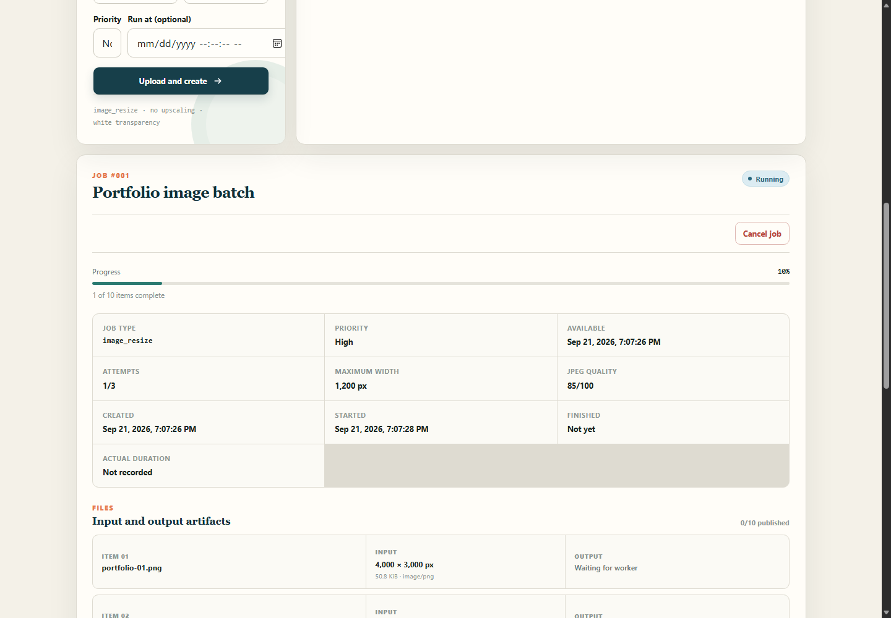
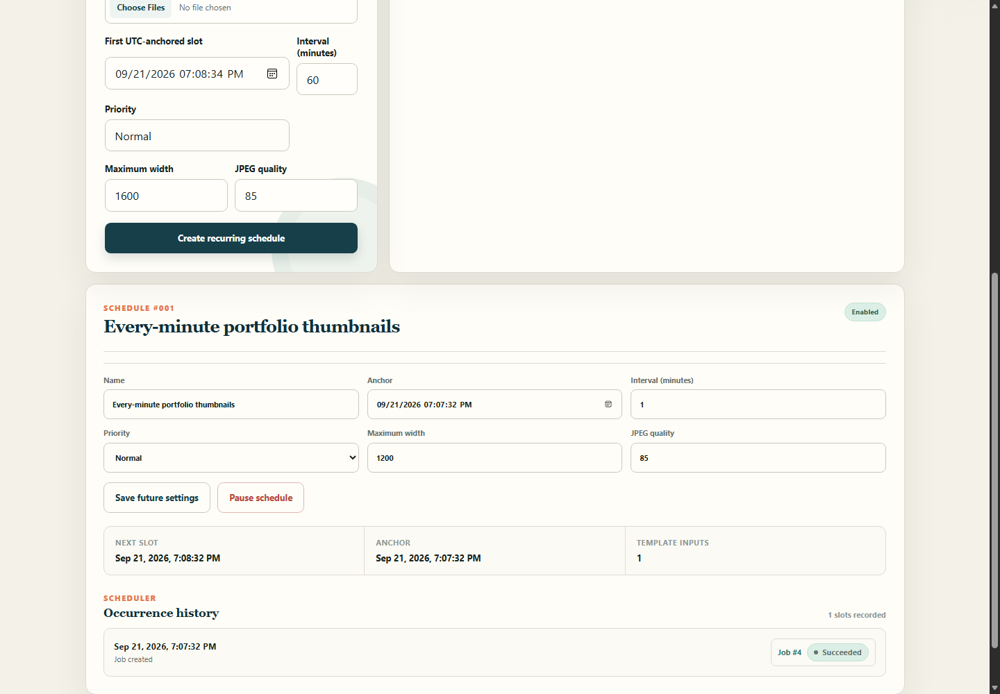
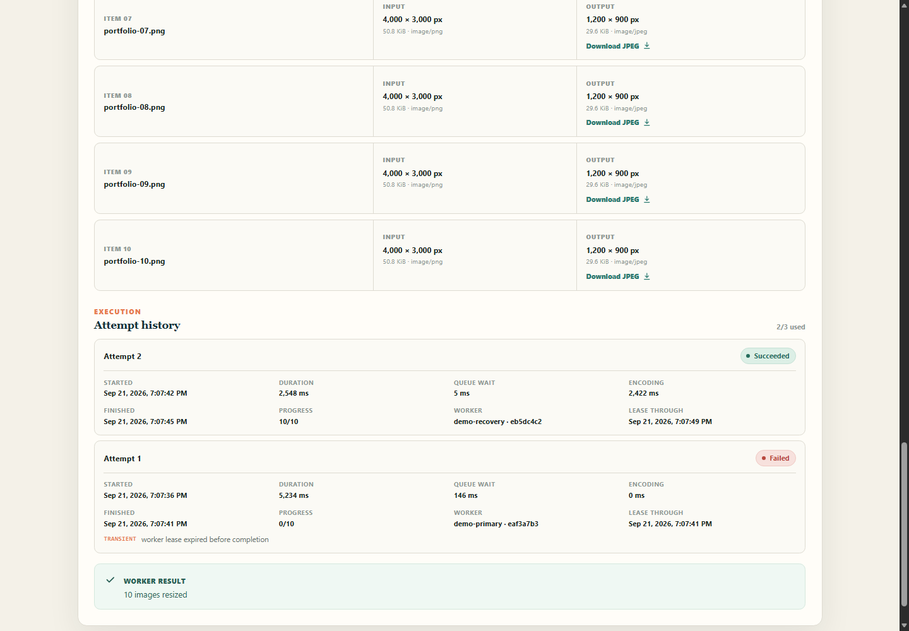

# Portfolio demo

[Watch the 3 minute 10 second TaskHarbor demo](assets/demo/taskharbor-demo.mp4).

The MP4 is a silent, captioned 1280×720 walkthrough built from screenshots captured during one real local run on 2026-09-21. It uses H.264 (`avc1.42E01E`), is 1,538,712 bytes, and its decoded duration is 189.8523 seconds. The dashboard was connected to release API and worker binaries, PostgreSQL 18.6, and actual shared storage; no UI response was mocked.

| Time | Evidence shown |
|---:|---|
| 0:00 | Scope of the real local demonstration |
| 0:12 | Ten 4000×3000 PNG inputs accepted as queued job #1 while no worker is running |
| 0:30 | `demo-primary` processing job #1 at 1/10 items |
| 0:52 | Ten outputs published together; one download fetched and checked for a JPEG signature |
| 1:14 | Cancelled future job #2 retried as linked job #3 and completed |
| 1:34 | One-minute anchored schedule #1 recording a due occurrence and successful job #4 |
| 1:56 | `demo-primary` terminated during recovery job #5 |
| 2:16 | Expired attempt 1 closed and fenced; `demo-recovery` completed attempt 2 |
| 2:42 | Worker page showing the replacement online and the terminated worker offline |
| 3:00 | Verified path recap |

The machine-readable capture summary is in [`assets/demo/evidence.json`](assets/demo/evidence.json). Its recovery job has two attempts owned by different worker registrations.

## Real UI evidence

Live processing was captured at 1 of 10 items:

The recurring schedule recorded a real occurrence linked to a successful job:

The recovery detail shows the expired first attempt and successful fenced second attempt, including separate queue and encoding durations:

Additional source captures in the same directory show the initial queue, published downloads, linked manual retry, killed-worker state, and worker fleet.

## Recording conditions and limits

- The run used a local isolated database and generated solid-color PNG inputs, so no third-party image license is involved.
- The worker lease was shortened to five seconds to keep the crash-recovery segment practical. The production default remains 15 seconds.
- Terminating the primary worker simulated a process crash. The database heartbeat and lease state, replacement attempt, outputs, and dashboard were real.
- The video has captions and no voice-over. It demonstrates behavior and evidence; it is not a performance measurement. Benchmark results are reported separately in [`benchmark.md`](benchmark.md).
- Public hosting is outside this repository. Compose serves the same application locally over a self-signed HTTPS certificate.
